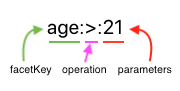
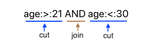
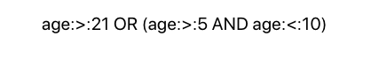
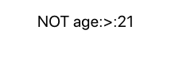
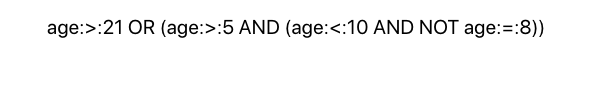

 

## [Demo](https://jbccollins.github.io/lapidary/demo/index.html)

### Configurable Faceted Filtering

##### *And what does that mean in practical terms...?*

##### - Filtering
The purpose of Lapidary is to allow a user to quickly filter datasets in complex ways without requiring a complex UI. This can be particularly useful for "power users" of your application.

##### - Faceted
The word `facet` in Lapidary world refers to any property that something has. For example "That car is red" implies that the car has a color property. "That car was made in 1994" implies that the car has a model year property. Consider `color` and `modelYear` as facets. If you have a set of cars with these facets then Lapidary can resolve queries like "Show me all cars that are either red or green and also have a model year between 2003 and 2008". Facets do not have to be as tangible as color (e.g. "Show me all cars that are duplicates") or even directly associated with an object (e.g. "Show me all cars that are on my wishlist"). See the advanced usage section for more info.

##### - Configurable
Lapidary allows you to define how users can filter a dataset. It comes built in with support for basic types like strings, number and dates but is fully extendable and can be configured to support whatever facets, operations and parameters you want.

##### *Sounds cool! But why is it called "Lapidary"?*
```
lapidary (noun): a person who cuts, polishes, or engraves gems.
```

The cuts on a gem are called facets. This library uses the word `facet` to refer to any property of an item. It lets you `cut` (filter) your data along any facets you want :)

<sub><sup>Oh and to continue the gem metaphor the logo color is the [hex for sapphire](https://www.colorhexa.com/0f52ba)</sup></sub>

## Usage

### Anatomy of a Lapidary query
Every Lapidary query consists of filters that can be combined in several ways. In keeping with the gem metaphor we'll refer to these filters as 'cuts'.
Each cut must match the regex `/.+:.*:.+/i`

Simply put they have to look like this:\


Each cut consists of three parts
1. <b>facetKey</b> - The property (facet) that this cut will operate on
2. <b>operation</b> - An indicator for the comparator function that is to be used
3. <b>parameters</b> - Give the comparator function something to compare against

Cuts can be linked using joins:\


There are two join types: `AND` and `OR`
Spaces between cuts are implicitly treated as an `AND` join type.
This means that `age:>:21 AND age:<:30` is equivalent to `age:>:21 age:<:30`. It is still possible to have spaces in your parameters by using quotes like so: `street:=:"Brookside Avenue"`

Cuts can be encapsulated inside parentheses:\


Cuts can be negated using the `NOT` keyword:\


Note that negation only affects cuts and encapsulations to the right and will affect <b>EVERY</b> cut and encapsulation to the right unless parentheses are used to restrict the domain of the negation.
For example

`age:>:21 AND NOT age:<:30 OR age:=:10`\
is equivalent to 
`age:>:21 AND NOT (age:<:30 OR age:=:10)`\
and can return different results than\
`age:>:21 AND (NOT age:<:30) OR age:=:10`

Cuts and encapsulations can be nested using parentheses:\


This screenshot kinda shows some of the more advanced types of queries you can do with Lapidary.
Right now I don't have documentation on what exactly is possible since so much is still in flux with the code.


At this point it's almost fully functional. I'd like to build a useful little input component around it to make it more approachable though.

### Advanced Usage

#### Abstract Facets

#### Context

### Best Practices

English is a weird language. And given the "pseudo code" feel of Lapidary queries it can be tempting to support operations that have a similar flow to the way we tend to speak. For example let's say you have data that has a color facet. In english it's natural to say "That thing is red". However you probably don't want to support `is::red`. Instead you want `color:=:red`. 

### Acknowledgements

Lapidary is heavily inspired by [Destiny Item Manager](https://github.com/DestinyItemManager/DIM)'s inventory search feature.

